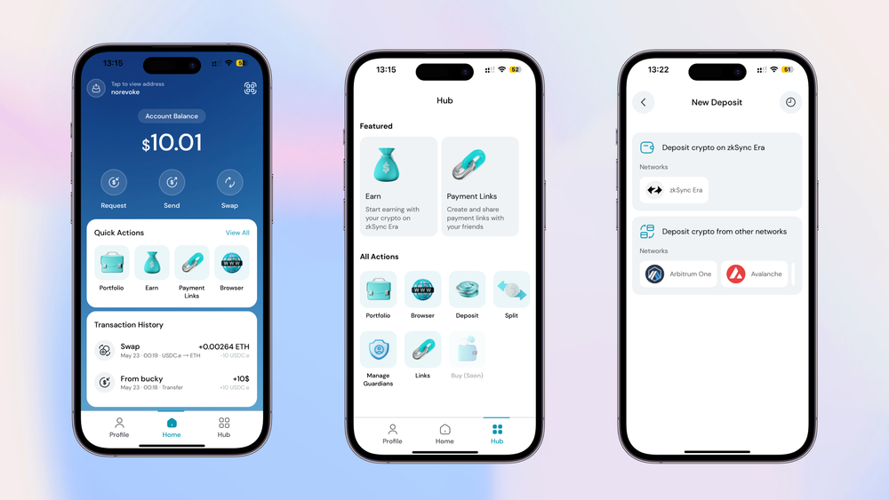

# Deposit

## **Cara Deposit ke Clave**

Menyetor dana ke akun Clave Anda kini lebih mudah berkat kemitraan kami dengan Layerswap. Baik Anda menggunakan Metamask atau dompet lainnya, panduan ini akan membantu Anda melalui langkah-langkah sederhana untuk mentransfer aset kripto Anda dari berbagai blockchain, termasuk Arbitrum One, Avalanche, Base, Binance Smart Chain, Ethereum, dan lainnya.

Dalam hitungan menit, Anda dapat memindahkan dana dengan lancar dan mulai menggunakan fitur Earn terbaru dari Clave. Baca terus untuk mempelajari cara melakukan setoran dengan cepat dan efisien.

**Panduan Deposit Langkah demi Langkah**

Dengan kerja sama antara Clave dan Layerswap, mentransfer aset kripto Anda ke zkSync Era Mainnet kini menjadi lebih mudah. Kemitraan yang kuat ini memastikan Anda dapat menyetor dana dari blockchain yang didukung dengan cepat dan hemat biaya. Baik Anda seorang pengguna kripto berpengalaman atau baru memulai, Layerswap menyederhanakan prosesnya, memungkinkan Anda untuk fokus mengeksplorasi peluang baru dalam ekosistem Clave. Mulai dari mengakses aplikasi terdesentralisasi hingga berpartisipasi dalam proyek terbaru, dana Anda akan siap digunakan dalam hitungan menit, memberi Anda lebih banyak waktu untuk menikmati fitur-fitur inovatif yang ditawarkan Clave.

**Mari Kita Lihat Cara Kerja Depositnya**

<figure><figcaption></figcaption></figure>

1. Buka **Dompet Clave.**
2. Ketuk **Hub** untuk melihat semua tindakan yang dapat Anda lakukan di Clave termasuk **Deposit**.
3. Ketuk **Deposit** : Di sini, Anda dapat melihat semua jaringan tempat Anda dapat mengirim dana.

<figure><figcaption></figcaption></figure>

4. Pilih jaringan tempat Anda menyimpan token kripto di dompet lain.
5. Pilih token mana dan berapa banyak yang ingin Anda setorkan.

<figure><figcaption></figcaption></figure>

6. Kirim token pada jaringan yang dipilih ke **Alamat Deposit**.

* Misalnya, kirim 0,1 ETH pada Optimism ke alamat yang diberikan.
* Ketika transfer selesai, token Anda akan disimpan secara otomatis ke akun Clave Anda.

7. Periksa status Deposit.

* Anda dapat memeriksa status deposit Anda di bagian "**Deposit Tertunda**".
* Anda akan menerima pemberitahuan ketika dana Anda masuk ke dompet Anda.

_**Deposit to your Clave account and be ready!**_
